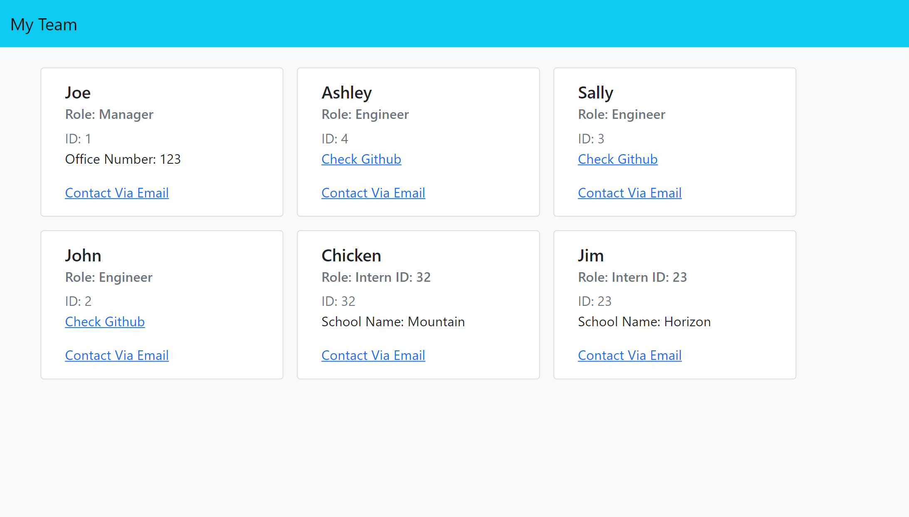

# my-team

This app will take your team member information and create a website with cards for each one.

## Installation

To install the required dependencies you need to run a "npm i" or "npm install".

## Usage

To run this app you will need to be in the root directory and use "node index".

## Credits

Victor L Perez

## Questions

If you have any questions please contact me at: [Zunaty@gmail.com](Zunaty@gmail.com) 

This is my GitHub: [Zunaty](https://github.com/Zunaty) 

### Preview and Video Link

[Video Walkthrough](https://drive.google.com/file/d/1VR0sO29ggoGT47rhqlKgF3c63_As-ODw/view)

